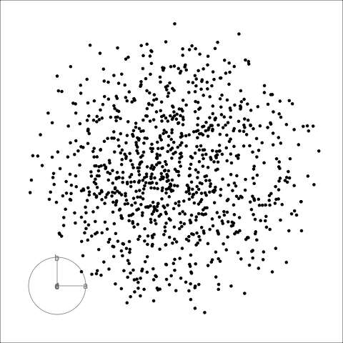
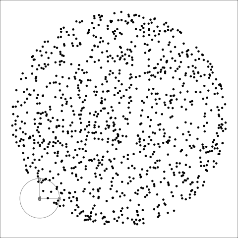
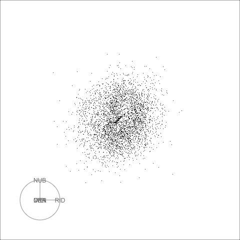
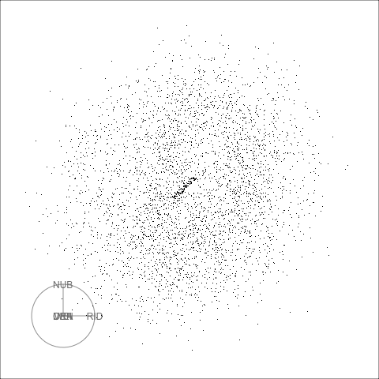
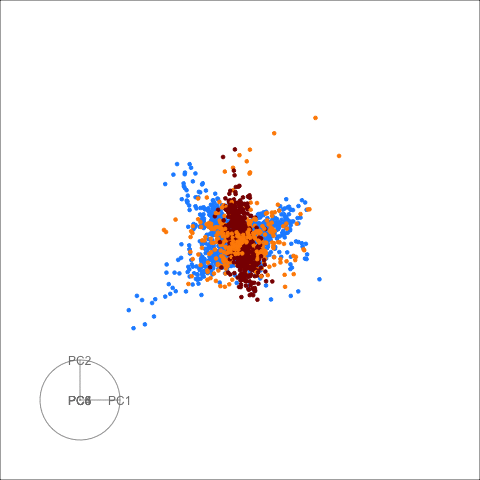
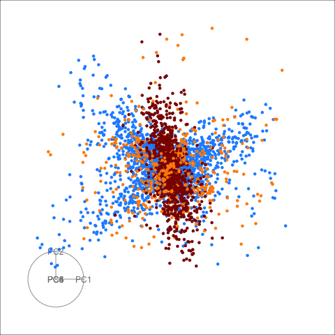

```{r setup, include=FALSE}
knitr::opts_chunk$set(
  echo = FALSE, 
  message = FALSE, 
  warning = FALSE,
  error = FALSE)
library(gifski)
```

# Intro

When projecting points that are uniformly sampled inside a $p$ dimensional hypersphere with radius $R$ onto a 2D plane, the cumulative distribution function (CDF) in radius is
\begin{equation}
f(r;p,R) = 1-\left(1-\left(\frac{r}{R}\right)^2\right)^{p/2}.
\label{eq:cdf}
\end{equation}
As $p$ increases, the distribution of points will be more peaked towards low values of $r$.
This is often unwanted as it makes it difficult to see patterns in the interesting region, and gives large optical weight to the tails of distribution.

Under the assumption that points are indeed from this distribution, we can invert the effect using the CDF. This is achieved by transforming $r$ such that the points follow the CDF of $f(r; 2, R)$ instead, i.e. starting from the distribution that arises for points that are uniform in the $p$ sphere, we find the transformation of $r$ that redistributes points such that they are uniform in a 2D disk.

In practice we get projected points in $x, y$ coordinates, and the first step is to calculate polar coordinates $r, \theta$. $\theta$ is always uniform for this distribution as follows from rotation invariance of the sphere. The radial component is transformed by first calculating the CDF to get a uniform distribution, and then transformed as the inverse of $f(r; 2, R)$ to arrive at the desired radial distribution. Thus we replace $r$ by $r'$ according to
\begin{equation}
r'' = f(r; p, R) = 1-\left(1-\left(\frac{r}{R}\right)^2\right)^{p/2} \\
r' = f^{-1}(r''; 2, R) = R \sqrt{r''} = R \sqrt{1-\left(1-\left(\frac{r}{R}\right)^2\right)^{p/2}}.
\end{equation}
Note that for the purpose of fitting the displayed data onto a pre-defined display (e.g. range $[-1,1]$), we can directly scale $r'$, e.g. by a factor $x/R$ where $x$ sets the range on the display, e.g. $x=0.9$ in what follows. We then calculate the new plotting coordinates $x', y'$ from $r', \theta$.

For the display function currently I calculate $R$ for each projection as the current maximum radius among all points, so this is not fixed across views. 

# Behaviour

The relation between the original and the transformed radius is shown in the plot below, for $R=1$. We see that the transformation is approximately linear near the center. As $p$ increases it becomes non-linear faster, and e.g. for $p=10$ the points with radius $r>0.5$ will alrady be highly distorted and pushed out towards the last eighth in $r'$.

```{r behaviour, fig.cap="Relation between $r$ and $r'$ for different values of $p$.", fig.height=3, fig.width=5, out.width="60%", fig.align = "center"}
library(tidyverse)
# define index as function of c
trans_p <- function(p){
  function(r){
    sqrt( 1 - (1-r^2)^(p/2))
  }
}
  
# plot dependence for selected values
ggplot(data = data.frame(x = c(0,1)), mapping = aes(x = x)) +
    stat_function(
        fun = trans_p(2),
        mapping = aes(color = "ca")) +
  stat_function(
        fun = trans_p(3),
        mapping = aes(color = "cb")) +
  stat_function(
        fun = trans_p(4),
        mapping = aes(color = "cc")) +
    stat_function(
        fun = trans_p(6),
        mapping = aes(color = "cd")) +
      stat_function(
        fun = trans_p(10),
        mapping = aes(color = "ce")) +
  scale_color_manual(name = "p",
                     values = RColorBrewer::brewer.pal(5, "Dark2"),
                     labels = c("2 (baseline)","3", "4", "6", "10")) +
  xlab("r") + ylab("r'") + theme_bw()

```


# Examples

As a first example lets look at a 6D full hypersphere. The animation on the left is the standard xy display, on the right the same dataset but with the fisheye display!



The second example is the pollen data, again we have xy display on the left, and fisheye display on the right. In this case I use pixels instead of points.



In the case of linear relations and higher number of dimensions the fisheye display can really distort the information, see the pdfsense data as an example. This is enhanced when looking at the full parameterspace rather than the 6 first principal components.




