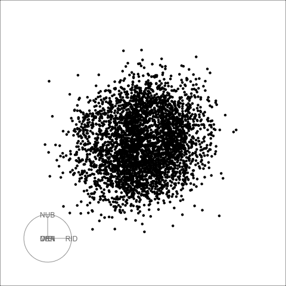

```{r setup, include=FALSE}
knitr::opts_chunk$set(
  echo = FALSE, 
  message = FALSE, 
  warning = FALSE,
  error = FALSE)
```

## pollen: parameter tuning

All sage displays: left is default, middle is $R=1$, and right is $\gamma=20$.

   

