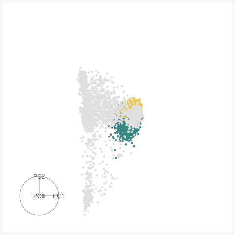

```{r setup, include=FALSE}
knitr::opts_chunk$set(
  echo = FALSE, 
  message = FALSE, 
  warning = FALSE,
  error = FALSE)
```


##  Single cell RNA-seq data from mouse retina

The left hand side is the regular tour
display, and the right hand side is sage display with $\gamma = 3$. 

 

