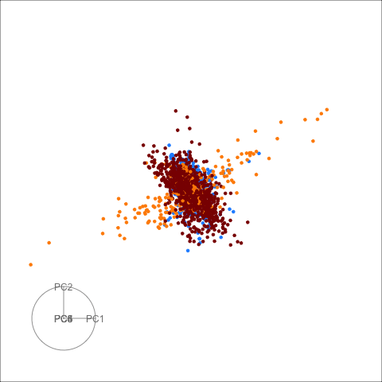
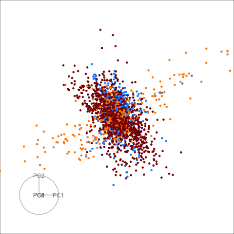

```{r setup, include=FALSE}
knitr::opts_chunk$set(
  echo = FALSE, 
  message = FALSE, 
  warning = FALSE,
  error = FALSE)
```

## pdfsense

Left hand side is the default grand tour display, and the right hand side is the sage display with $R = 10$.

 
