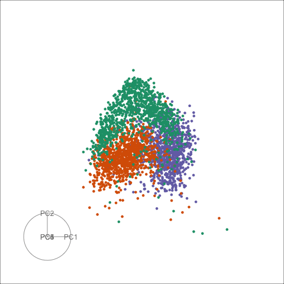

```{r setup, include=FALSE}
knitr::opts_chunk$set(
  echo = FALSE, 
  message = FALSE, 
  warning = FALSE,
  error = FALSE)
```

## QuickDraw Sketches

The left hand is the default grand tour display and the right hand side is the default sage display.

 
