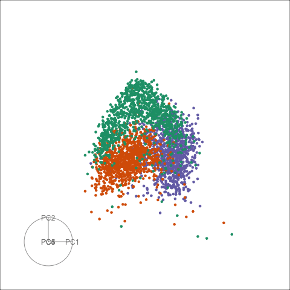
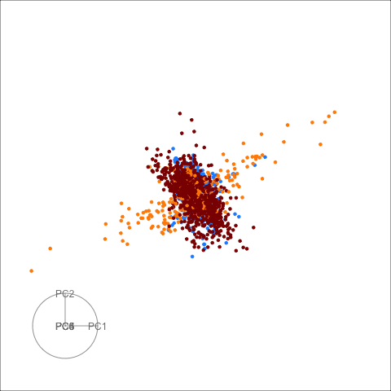
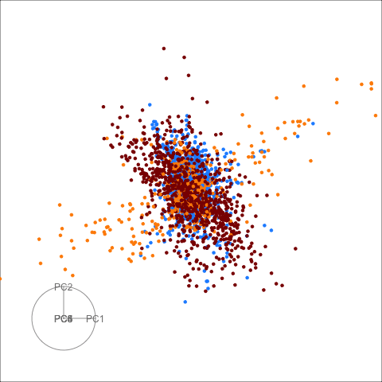

```{r setup, include=FALSE}
knitr::opts_chunk$set(
  echo = FALSE, 
  message = FALSE, 
  warning = FALSE,
  error = FALSE)
```

# Intro 

Here we provide side by side view of animations provided in the case studies of our paper:

>  Burning sage: Reversing the curse of dimensionality in the visualisation of high-dimensional data

The left hand side is always the grand tour, and the right is the sage tour.

##  Single cell RNA-seq data from mouse retina

Setting sage with $\gamma = 3$

 

## QuickDraw Sketches

 


## pdfsense

Setting sage tour with $R = 10$.

 


## pollen: parameter tuning

All sage displays: left is default, middle is $R=1$, and right is $\gamma=20$.

   

